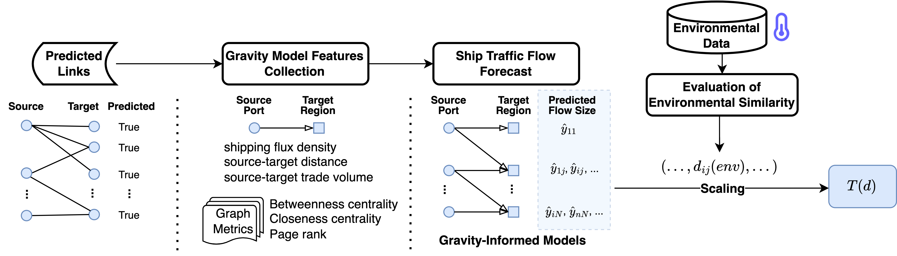
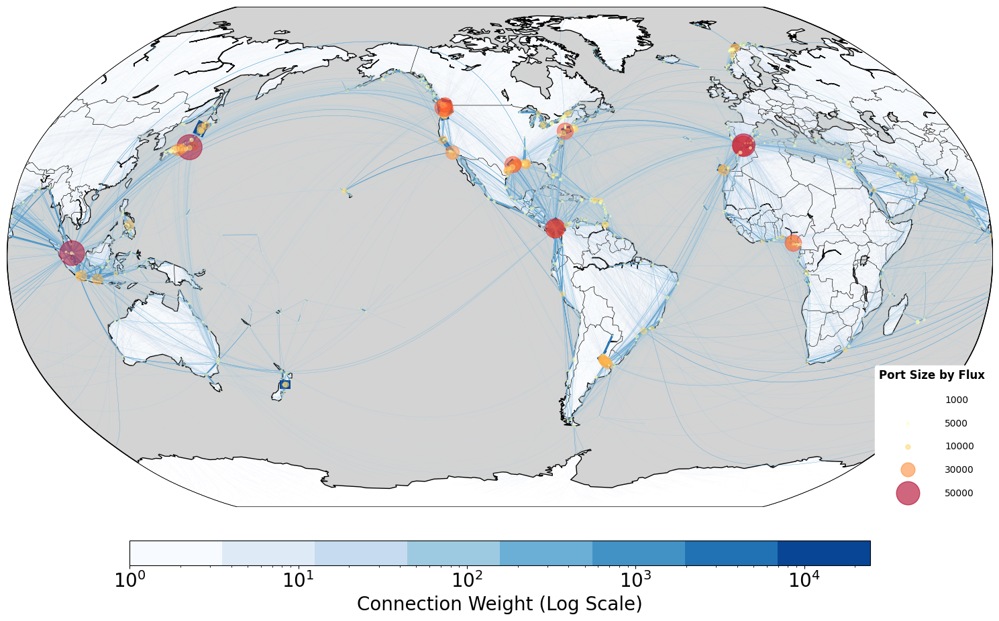
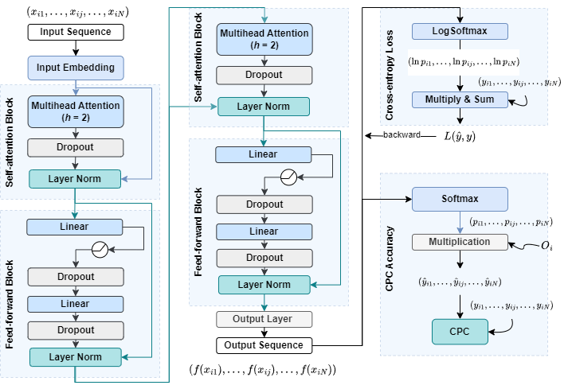
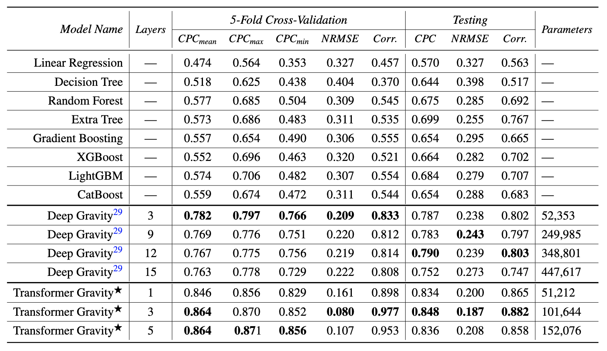
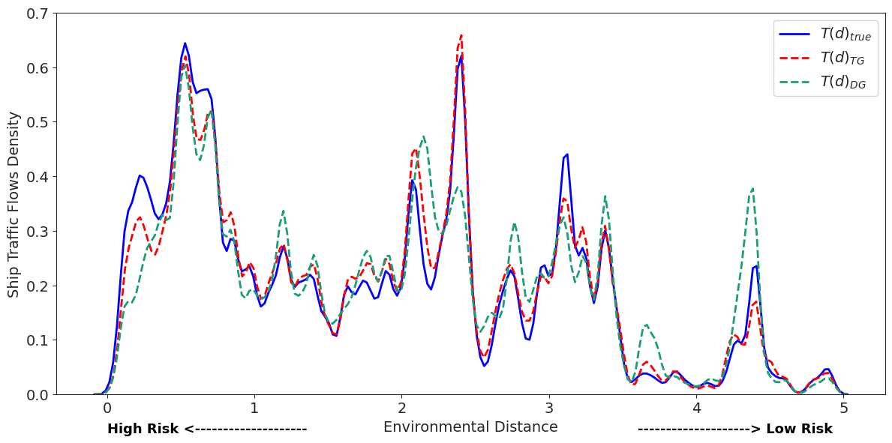

# TransformerGravity: a gravity-inspired deep learning framework for maritime traffic prediction in the global shipping network

## Table of Contents
0. [Overview](#overview)
1. [Analytical Pipeline](#analytical-pipeline)
    - [Shipping network analysis](#shipping-network-analysis)
    - [Ship traffic flow prediction](#flow-prediction)
    - [Case study with ballast water risk assessment (BWRA)](#bwra-case-study)
2. [Running Notebook](#running-notebook)
    - [Setup](#setup)
    - [Functional script](#script)
    - [Trained models](#model)
3. [Source Data](#data)
4. [Citation](#cite)

[References](#reference)

<a id='overview'></a>
## 0. Overview

Maritime shipping traffic is a critical component of global trade, with significant implications for economic activities and environmental management. 
This project develops a novel physics-informed model, named ***TransformerGravity***, to forecast maritime shipping traffic between port regions worldwide. Inspired by the gravity model for mobility studies, our approach incorporates various factors that influence the likelihood and impact of vessel activities, such as shipping flux density, distance between ports, international trade flow, and centrality measures of transportation hubs.

Our model introduces transformers to the gravity model framework, enhancing the ability to capture both short- and long-term dependencies in maritime traffic data. This innovation enables us to achieve an 84.8% accuracy for forecasting the number of vessels flowing between key port areas, representing more than a 10% improvement over the *DeepGravity* model ([Simini et al., 2021](#R1)) with MLPs sturcture and 50% improvement over traditional machine learning models.

In addition to its primary focus on shipping traffic flow prediction, the model's predicted information is also used as input for risk assessments related to the spread of non-indigenous species (NIS) through transportation networks. This application provides valuable insights for evaluating the capability of our solution in mitigating potential environmental impacts.

<a id='analytical-pipeline'></a>
## 1. Analytical Pipeline

The whole analytical pipeline include three primary sections: (1) shipping network analysis, (2) vessel traffic flow prediction, and (3) a case study with ballast water risk assessment (BWRA), as illustrated in *Figure 2*.



*Figure 1. Experiment pipeline for analyzing and predicting links in the global shipping network, forecasting vessel traffic flows using gravity-informed models, and assessing environmental similarity for ballast water risk assessment in a case study.*


<a id='shipping-network-analysis'></a>
### Shipping network analysis

The analysis begins with the construction of a global shipping network (*Figure 3*) using vessel movement data from 2017 to 2019 derived from ([Carlini et al., 2022](#R2)) and port information from the *[World Port Index](#D1)*. Centrality and PageRank graph metrics were then calculated as part of the feature set for vessel flow prediction. 
As disconnected and weakly connected components were detected, we fully connected the shipping network and performed link prediction to discriminate existing and non-existing shipping connections.


*Figure 2. Global shipping network 2017-2019.*


<a id='flow-prediction'></a>
### Ship traffic flow prediction with gravity-informed models

These predicted links were then used to inform potential origin-destination (OD) pairs for gravity-informed models to forecast vessel traffic flows.

***TransformerGravity*** model is designed for vessel traffic flow prediction, incorporating stacked transformers and features from the gravity model (i.e., shipping fluxes at ports and distances between sources and destinations in the shipping network), international bilateral trade volume, and graph metrics of the shipping network. 
As illustrated in *Figure 1*, the process begins with input sequences that are embedded and passed through self-attention blocks with multi-head attention, dropout, and layer normalization. This is followed by feed-forward blocks containing linear layers and dropout, resulting in the output sequence. The model is trained using cross-entropy loss with log-softmax, and its performance is evaluated using the *Common Part of Commuters (CPC)* metric, which incorporates commuting patterns from the input data.


*Figure 3. Framework of the TransformerGravity model with two transformer encoder layers.*

Detailed explanations of the model structure, including layer-by-layer descriptions, evaluation metrics, and training configurations, can be found in the `Methods` section of our paper, *"Enhancing Global Maritime Traffic Network Forecasting with Gravity-Inspired Deep Learning Models"* [[arXiv](https://arxiv.org/abs/2401.13098)].

For comparison, we also performed the vessel flow prediction using *DeepGravity* with MLPs structure and the traditional machine learning models. *Table 1* shows the performance of different models with several evaluation metrics.


*Table 1. Performance evaluation of the Transformer, Deep Gravity models and their shallower-layered variants, and other baseline models.*


<a id='bwra-case-study'></a>
### Case study with ballast water risk assessment (BWRA)

As part of the study, we assessed the risk of Non-Indiginous Species (NIS) introduction associated with shipping flows using the BWRA decision tool employed by Transport Canada ([Bradie and Bailey, 2021](#R3)).
This risk model produces an environmental distance value that compares the dissimilarities between a ship's origin and destination. When a ship arrives at a destination and comes from an origin with similar environmental characteristics (*i.e.,* higher risk) as the destination port, it is more likely to be inspected by the responsible authorities. These environmental distance values inform the threat levels associated with various shipping pathways. Then, we integrated the environmental distance values with the shipping intensity by weighting environmental distance according to the number of trips on specific shipping routes. 
This combination of both threat levels and shipping intensity enables the mapping of the overall distribution of shipping activities across the global network at varying invasion risk levels, as shown in *Figure 4*.


*Figure 4. Distribution of environmental distances weighted by shipping flows in 2019.*

<a id='running-notebook'></a>
## 2. Running Notebook

<a id='setup'></a>
### Setup

Most of the dependencies are installed defautly with Python and by command when running the notebook. We recommand the following versions of Python, PyTorch, and scikit-learn:

`Python 3.10`

`PyTorch 2.0.1`

`scikit-learn 1.5.0`

<a id='script'></a>
### Functional script

`./utils/util.py`: Contains frequently reused functions for tasks such as dataframe processing, calculating earth distances, and CPC metric calculations.

<a id='model'></a>
### Trained models

The following PyTorch models in folder `models` have been trained on 2017-2018 global shipping data and can be directly imported for 2019 vessel traffic flow prediction:

`Model_OneTransformerDeepGravity.pth`: *TransformerGravity* model with 1 transformer encoder layer

`Model_3TransformerDeepGravity.pth`: *TransformerGravity* model with 3 transformer encoder layers

`Model_5TransformerDeepGravity.pth`: *TransformerGravity* model with 5 transformer encoder layers

`Model_3TraditionalDeepGravity.pth`: *DeepGravity* model with 3 feed-forward layers

`Model_9TraditionalDeepGravity.pth`: *DeepGravity* model with 9 feed-forward layers

`Model_12TraditionalDeepGravity.pth`: *DeepGravity* model with 12 feed-forward layers

`Model_15TraditionalDeepGravity.pth`: *DeepGravity* model with 15 feed-forward layers (original *DeepGravity*)

<a id='data'></a>
## 3. Source Data

<a id='D1'></a>
- National Geospatial-Intelligence Agency (NGA). World Port Index (Pub 150). https://msi.nga.mil/Publications/WPI (2019).
<a id='D2'></a>
- The Growth Lab at Harvard University. International trade data (SITC, rev. 2), DOI: 10.7910/DVN/H8SFD2 (2019).
- 2017-2019 ship movement data: sourced from ([Carlini et al., 2022](#R2)).
- Environmental conditions at ports: sourced from ([Bailey et al., 2020](#R4))

<a id='cite'></a>
## 4. Citation

If you find our work helpful in your study, we kindly ask you to cite it as follows:

```
@misc{TransformerGravityVesselFlowPrediction2024,
      title={Gravity-Informed Deep Learning Framework for Predicting Ship Traffic Flow and Invasion Risk of Non-Indigenous Species via Ballast Water Discharge}, 
      author={Ruixin Song and Gabriel Spadon and Ronald Pelot and Stan Matwin and Amilcar Soares},
      year={2024},
      eprint={2401.13098},
      archivePrefix={arXiv},
      primaryClass={cs.LG},
      url={https://arxiv.org/abs/2401.13098}, 
}
```

<a id='reference'></a>
## References

<a id='R1'></a>
[1] F. Simini, G. Barlacchi, M. Luca, L. Pappalardo, A Deep Gravity model for mobility flows generation, Nature Communications 12, 6576 (2021). https://doi.org/10.1038/s41467-021-26752-4

<a id='R2'></a>
[2] Carlini, E. et al. Understanding evolution of maritime networks from automatic identification system data. GeoInformatica 26, 479–503 (2022). https://doi.org/10.1007/s10707-021-00451-0.

<a id='R3'></a>
[3] Bradie, JN, Bailey, SA. A decision support tool to prioritize ballast water compliance monitoring by ranking risk of non-indigenous species establishment. *J Appl Ecol.* 2021; 58: 587– 595. https://doi.org/10.1111/1365-2664.13822

<a id='R4'></a>
[4] Bailey, Sarah; Bradie, Johanna; Ogilvie, Dawson; Mudroch, Paul., Global port environmental data used for environmental distance calculations, *Dryad*, Dataset (2020) https://doi.org/10.5061/dryad.69p8cz906